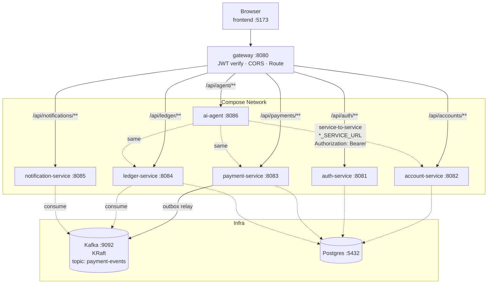
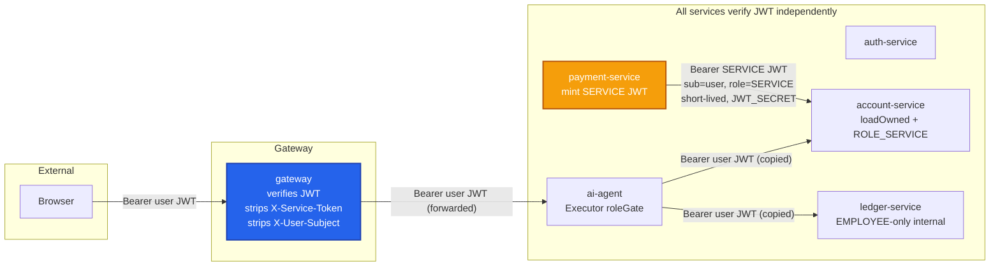
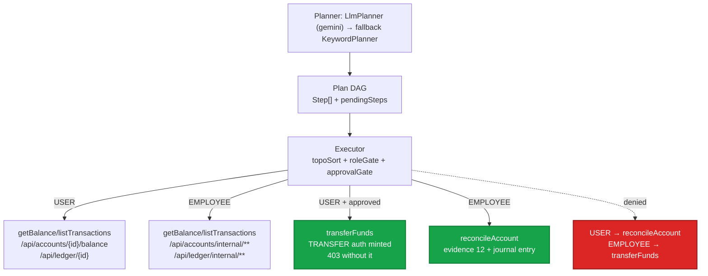
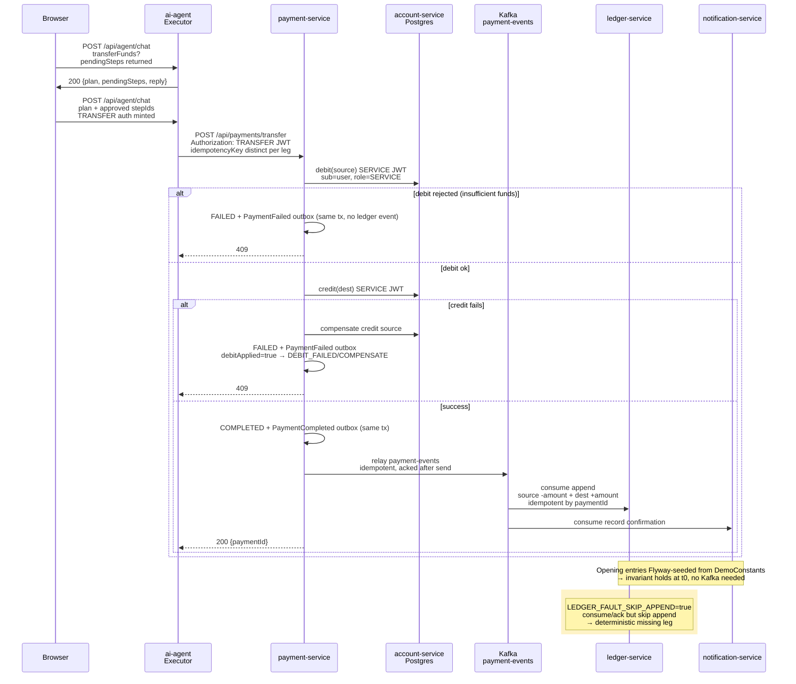
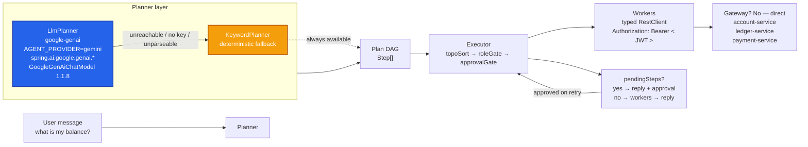

# Architecture

## Topology

The `ai-agent` calls the backend **directly** (service-to-service) via
`*_SERVICE_URL`, copying the caller''s `Authorization` header. The gateway only
fronts the external frontend→agent hop. Every service re-verifies the JWT
(**zero internal trust**).

`/api/agent/**` serves **both** roles with a per-role tool matrix enforced in the
executor (the caller''s role comes from the verified JWT, not the client):

| Tool | USER (customer) | EMPLOYEE (ops) |
|---|---|---|
| `listAccounts` | own accounts | own (none seeded) |
| `getBalance` | ownership-scoped endpoint | internal endpoint, any account |
| `listTransactions` | ownership-scoped endpoint | internal endpoint, any account |
| `transferFunds` | ✅ with approval (`pendingSteps`) | ❌ denied — investigation-only |
| `reconcileAccount` | ❌ denied — ops only | ✅ evidence + corrective entry |

The agent''s internal reads (`/api/accounts/internal/**`, `/api/ledger/internal/**`)
are EMPLOYEE-only at the service layer — a USER token can never reach a
cross-account read, even if the planner proposes it. The customer-facing
`/api/ledger/{accountId}` is ownership-scoped via a delegated check against
account-service (other accounts → 404).

Internal **mutates** (`debit`/`credit`) are the only endpoints that may run under
a user-context **service** principal: `payment-service` mints a short-lived
signed JWT (subject = the acting user, role = `SERVICE`, signed with the shared
`JWT_SECRET`) and presents it as the `Authorization` header, so `account-service`
still enforces ownership while granting `ROLE_SERVICE` for the leg. There is no
static shared bearer: the legacy `X-Service-Token`/`X-User-Subject` path is gone,
and the gateway strips those headers from every external request. Anything else
under `/api/accounts/internal/**` remains EMPLOYEE-only.

Transfers are approval-gated **at the API boundary**: the ai-agent mints a
short-lived signed `TRANSFER` authorization (bound to the caller''s subject and
the transfer''s idempotency key) only after an approved `transferFunds` step has
passed the executor''s approval gate, and `payment-service` rejects any transfer
that does not present it (`403 TRANSFER_UNAUTHORIZED`). A direct call to
`/api/payments/transfer` without that authorization is refused — approval is
server-enforced, not a UI convention.

## Data flow — a transfer

1. `payment-service` runs the saga: `debit(source)` → `credit(dest)`, each with a
   **distinct** `idempotencyKey`; on credit failure it compensates (credits
   source back).
2. On success it writes a `PaymentCompleted` outbox row (same local DB tx),
   relayed to Kafka topic `payment-events` (idempotent, acked after send).
3. On failure the FAILED payment and a `PaymentFailed` outbox row commit in the
   same local DB tx (nothing is rolled back) and the API returns 409. The event
   carries `debitApplied` so the ledger only records the
   `DEBIT_FAILED`/`COMPENSATE` pair when the debit had actually moved money; a
   rejected debit (e.g. insufficient funds) records nothing.
4. `ledger-service` consumes and appends `source -amount` + `dest +amount`
   (idempotent by `paymentId`). `notification-service` consumes and records a
   confirmation.
5. Opening ledger entries are Flyway-seeded from `DemoConstants`, so the
   reconciliation invariant holds at t0 with no Kafka dependency.

## Money & consistency
- `Money` is a `BigDecimal` (scale 2, HALF_UP), serialized as a JSON **string**.
- Ownership enforced at `account-service` (`loadOwned`); `payment-service`
  propagates the caller JWT.
- `LEDGER_FAULT_SKIP_APPEND=true` makes the ledger consume/ack but skip the
  append — the deterministic "missing leg" break for the demo.

## Agent

One agent, two role surfaces. Primary planner is `LlmPlanner` using Spring AI''s
`google-genai` starter (`AGENT_PROVIDER=gemini` default, key via
`AGENT_GEMINI_API_KEY`, model via `AGENT_GEMINI_MODEL`, wired through
`spring.ai.google.genai.*`); local Ollama is an alternative provider
(`AGENT_PROVIDER=ollama` + `SPRING_AI_OLLAMA_BASE_URL`). Spring AI 1.1.x ships the
Google GenAI starter (`GoogleGenAiChatModel`); the stack pins the 1.1.8 BOM with
Boot 3.5.16 / Spring Cloud 2025.0.3. With no key, the starter''s sentinel default
(`not-set`) keeps the context boot-safe and `LlmPlanner` drops to keyword-only.
The deterministic `KeywordPlanner` is the mandatory safety net — any LLM failure
(unreachable model, missing key, unparseable output) falls back to it, so the
demo never hard-fails. The executor runs
the plan DAG; workers are typed REST clients over the real backend.
Mutating steps become `pendingSteps` requiring explicit approval; the frontend
re-calls with the same `plan` + approved `stepIds` and idempotency key.
`reconcileAccount` (ops) replies with the root cause, a 12-entry evidence
trail, and a proposed corrective journal entry (not executed).

Architecture decisions (Spring AI + custom harness = ADR-0007, and any other ADRs):
see [our architecture decision records](../infra/docs/adrs/).

